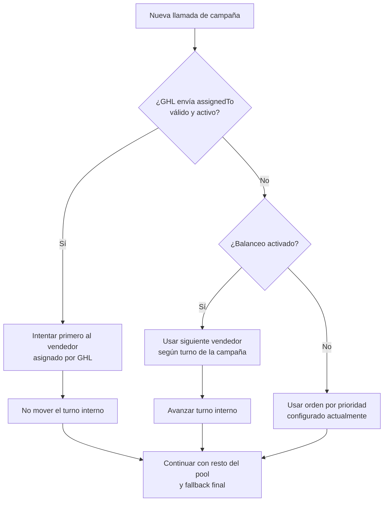

# Plan de Balanceo de Llamadas entre Vendedores

> **Documento de planeación para socios**  
> **Estado:** propuesta funcional aprobada para planeación técnica  
> **Fecha:** junio de 2026  
> **Fuente operativa:** Admin de Revenio + Base de Datos

## Resumen ejecutivo

Actualmente, Revenio intenta transferir cada nueva llamada al primer vendedor activo configurado en la campaña. Si ese vendedor no contesta, el sistema continúa con el resto del pool y finalmente usa el fallback.

La propuesta agrega una opción por campaña para distribuir de forma equilibrada quién recibe el primer intento:

```text
☐ Activar balanceo de llamadas entre vendedores
```

Cuando esta opción esté activa, Revenio rotará el vendedor inicial de cada nueva llamada. El orden de failover continuará siendo estable y predecible durante toda la llamada.

### Objetivo

Repartir de forma más justa las oportunidades entre vendedores sin modificar la lógica actual de failover:

```text
vendedor inicial -> resto del pool -> fallback final
```

---

## Por qué balanceo y no shuffle aleatorio

Un shuffle aleatorio mezcla vendedores en cada llamada, pero no garantiza una distribución justa. Por azar, un vendedor podría quedar primero varias veces seguidas.

El balanceo propuesto usa una rotación circular. Esto garantiza que todos los vendedores activos tengan su turno como primer contacto antes de volver a empezar.

### Ejemplo

Con un pool de tres vendedores:

```text
Ana -> Luis -> Sofía
```

El orden inicial de cada llamada será:

| Llamada | Orden de intentos |
| --- | --- |
| Llamada 1 | Ana -> Luis -> Sofía -> fallback |
| Llamada 2 | Luis -> Sofía -> Ana -> fallback |
| Llamada 3 | Sofía -> Ana -> Luis -> fallback |
| Llamada 4 | Ana -> Luis -> Sofía -> fallback |

---

## Comportamiento por campaña

Cada campaña conservará su propio interruptor y su propio turno interno.

| Modo | Comportamiento |
| --- | --- |
| **Balanceo apagado** | Conserva el comportamiento actual: vendedores en orden de prioridad configurado. |
| **Balanceo activado** | Rota el primer vendedor entre los agentes activos y conserva el resto en orden circular. |

La opción vivirá dentro de la configuración de cada campaña en Admin:

```text
☐ Activar balanceo de llamadas entre vendedores
```

Texto de ayuda sugerido:

> Distribuye el primer intento entre los vendedores activos. Si el vendedor inicial no contesta, Revenio continúa con el resto del equipo y finalmente con el fallback.

---

## Respeto a la asignación de GHL

Si GoHighLevel (GHL) envía un `assignedTo` válido, Revenio debe respetar esa asignación antes que el balanceo interno.

### Caso 1: GHL envía un vendedor asignado válido

```text
assignedTo de GHL
  -> resto de vendedores activos
  -> fallback final
```

Esta llamada **no avanza** el turno interno de balanceo, porque Revenio no eligió al primer vendedor.

### Caso 2: GHL no envía `assignedTo` o no coincide con un vendedor activo

```text
siguiente vendedor según turno de la campaña
  -> resto del pool en orden circular
  -> fallback final
```

Esta llamada **sí avanza** el turno interno para que la siguiente oportunidad empiece con otro vendedor.



---

## Cómo se conserva el failover

El balanceo solo cambia el orden inicial de vendedores para una llamada nueva. Una vez iniciado el intento, Revenio guarda una fotografía del pool ordenado.

Ejemplo:

```text
Snapshot guardado para una llamada:
Luis -> Sofía -> Ana -> fallback
```

Si Luis no contesta, el sistema continúa con Sofía. Si Sofía tampoco contesta, continúa con Ana. La lista no vuelve a ordenarse a mitad de la llamada.

Esto permite agregar balanceo sin alterar la lógica delicada que actualmente gestiona transferencias, buzones de voz y fallback en Twilio.

---

## Modelo conceptual

Cada campaña necesita dos datos adicionales:

| Campo conceptual | Uso |
| --- | --- |
| `callBalancingEnabled` | Define si la campaña usa rotación equilibrada o prioridad fija. |
| `callBalancingCursor` | Guarda qué vendedor debe iniciar la siguiente llamada cuando Revenio elige el primer intento. |

```text
Campaña
  ├── Vendedores activos ordenados por prioridad
  ├── Fallback final
  ├── Balanceo activado: sí / no
  └── Turno interno para siguiente llamada

Nueva llamada sin assignedTo válido
  ├── Resolver vendedor inicial según turno
  ├── Rotar pool en orden circular
  ├── Guardar snapshot del orden elegido
  └── Avanzar turno para la próxima llamada
```

---

## Casos especiales

| Escenario | Comportamiento esperado |
| --- | --- |
| Campaña con balanceo apagado | Usa el orden por prioridad actual. |
| Solo un vendedor activo | Siempre intenta a ese vendedor y luego fallback. |
| Vendedor inactivo | Se excluye del pool antes de calcular el turno. |
| Cambio en el orden de vendedores | La siguiente llamada usa el pool activo actualizado. |
| `assignedTo` válido desde GHL | Ese vendedor va primero y no modifica el cursor interno. |
| `assignedTo` inválido o vacío | Revenio usa y avanza el turno interno. |
| Todos los vendedores fallan | Revenio continúa usando el fallback final actual. |
| Llamada ya iniciada | Conserva el snapshot guardado aunque después cambie la configuración. |

---

## Implementación sugerida

### Fase 1: Persistencia por campaña

Agregar el interruptor de balanceo y el turno interno en la Base de Datos.

### Fase 2: Resolución del pool

Crear una función que rote el pool activo en orden circular cuando:

- la campaña tiene balanceo activado;
- GHL no envía un `assignedTo` válido;
- Revenio necesita elegir al primer vendedor.

### Fase 3: Integración con llamadas

Aplicar la misma regla al webhook de GHL y a las llamadas de prueba desde Admin. Guardar el pool resuelto en el snapshot existente para mantener el failover estable.

### Fase 4: Configuración desde Admin

Agregar el interruptor:

```text
☐ Activar balanceo de llamadas entre vendedores
```

El valor se guarda dentro de la campaña seleccionada, sin tocar Railway ni variables de entorno.

### Fase 5: Pruebas

Validar:

- rotación circular con múltiples llamadas;
- compatibilidad con campañas que mantienen prioridad fija;
- respeto a `assignedTo`;
- exclusión de vendedores inactivos;
- continuidad del snapshot durante failover;
- fallback final después de agotar el pool;
- llamadas de prueba desde Admin.

---

## Complejidad estimada

La complejidad es **media-baja**.

El cambio es acotado porque Revenio ya guarda el orden del pool dentro de cada intento. No es necesario reescribir la lógica de failover en Twilio: solamente cambia cómo se elige y guarda el orden inicial.

Estimación razonable:

```text
1 día de implementación y pruebas
+ migración de Base de Datos
+ despliegue y validación en staging
```

---

## Alcance del MVP

La primera versión incluirá:

- interruptor por campaña;
- rotación equilibrada del primer vendedor;
- respeto prioritario a `assignedTo` de GHL;
- cursor interno que solo avanza cuando Revenio elige al primer vendedor;
- snapshot estable para failover;
- fallback final sin cambios.

Quedan fuera por ahora:

- porcentajes distintos por vendedor;
- límites diarios individuales;
- reparto por horario o disponibilidad en tiempo real;
- reportes estadísticos nuevos de distribución;
- configuración global que reemplace el interruptor por campaña.

