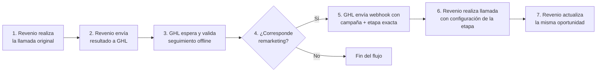
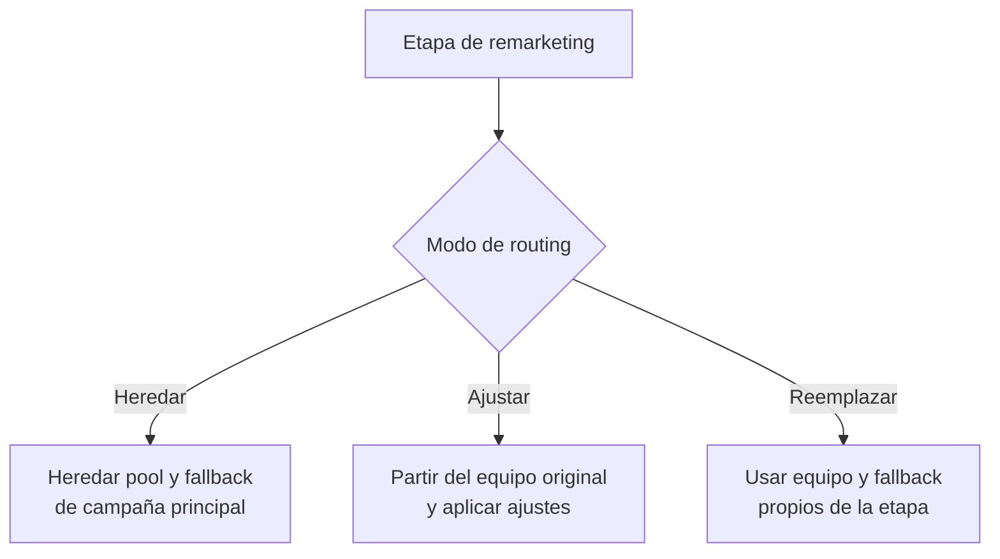

# Plan de Remarketing Automatizado por Campaña

> **Documento de planeación para socios**  
> **Estado:** propuesta funcional para revisión  
> **Fecha:** junio de 2026  
> **Fuente operativa:** Admin de Revenio + Base de Datos

## Resumen ejecutivo

Queremos agregar dentro de cada campaña un módulo de **remarketing** para volver a contactar leads cuando GoHighLevel (GHL) confirme que no ocurrió una conversión o seguimiento offline.

El flujo actual ya permite que Revenio realice una llamada y envíe su resultado a GHL. La propuesta extiende ese ciclo:

1. Revenio realiza la llamada original.
2. Revenio envía a GHL el resultado, vendedor conectado y grabación.
3. GHL espera y verifica si ocurrió seguimiento offline.
4. Si corresponde hacer otro intento, GHL envía un webhook indicando la etapa exacta de remarketing.
5. Revenio realiza una nueva llamada con el speech, número telefónico y routing comercial configurados para esa etapa.
6. Revenio actualiza la misma oportunidad en GHL.

### Principios centrales

| Principio | Decisión |
| --- | --- |
| Control comercial | GHL decide cuándo corresponde volver a llamar. |
| Flexibilidad | Cada etapa puede usar otro assistant de Vapi, otro speech y otro número de salida. |
| Operación simple | Las etapas se administran dentro de la campaña original. |
| Protección contra errores | Revenio evita llamadas duplicadas si GHL reenvía accidentalmente el mismo webhook. |

---

## Flujo propuesto



**GHL decide el momento y la etapa. Revenio valida, ejecuta la llamada y conserva el historial.**

---

## Nuevo módulo dentro de cada campaña

En el Admin, cada campaña tendrá una sección llamada **Remarketing**. Ahí se podrá crear una secuencia configurable sin límite fijo de etapas.

```text
Campaña principal
  └── Remarketing
        ├── RM-1 · Seguimiento 24 horas
        ├── RM-2 · Seguimiento 3 días
        └── RM-3 · Último intento
```

El equipo podrá crear, ordenar, editar y pausar etapas individuales sin detener el resto de la campaña.

### Configuración de cada etapa

| Campo | Propósito |
| --- | --- |
| `remarketingStepId` | ID estable que se copia al workflow de GHL, por ejemplo `rm-24h`. |
| Nombre | Etiqueta entendible para operación, por ejemplo `Seguimiento 24 horas`. |
| `Vapi Assistant ID` | Permite usar un speech específico para ese momento del seguimiento. |
| `Vapi Phone Number ID` | Permite llamar desde un número distinto al de la campaña original. |
| Estado | Activa o pausada. Una etapa pausada no genera llamadas. |
| Routing comercial | Define si usa, ajusta o reemplaza vendedores y fallback. |
| Posición | Orden visual para que el equipo entienda la secuencia configurada. |

---

## Routing comercial

Cada etapa usa por defecto los mismos vendedores humanos y fallback final de la campaña principal. Cuando el seguimiento requiera otro equipo, el Admin permitirá modificar el comportamiento de esa etapa.

| Modo | Comportamiento |
| --- | --- |
| **Heredar** | Usa exactamente el pool de vendedores y fallback de la campaña principal. Es el modo recomendado por default. |
| **Ajustar** | Parte del equipo original y permite agregar, quitar o modificar vendedores y fallback para esa etapa. |
| **Reemplazar** | Usa un pool y fallback completamente propios cuando el remarketing pertenece a otro equipo comercial. |



---

## Reglas de negocio acordadas

| Tema | Decisión |
| --- | --- |
| Disparador | GHL manda un webhook cuando corresponde realizar remarketing. |
| Cantidad de etapas | Secuencia configurable sin límite fijo dentro de cada campaña. |
| Selección de etapa | GHL envía el `remarketingStepId` exacto que Revenio debe ejecutar. |
| Routing | Se hereda por default, con opciones de ajustar o reemplazar por etapa. |
| Horario permitido | Todas las etapas respetan el horario de la campaña principal. |
| Campaña pausada | Detiene llamadas originales y todas las llamadas de remarketing. |
| Etapa pausada | Detiene solamente esa etapa sin afectar el resto de la campaña. |
| Resultado post-llamada | Revenio actualiza la misma oportunidad en GHL usando el flujo actual. |
| Duplicados | Solo se permite una llamada por `opportunityId + remarketingStepId`. |

---

## Integración con GHL

El workflow de GHL enviará la campaña, la oportunidad y la etapa concreta que Revenio debe ejecutar.

El payload exacto se cerrará durante el diseño técnico, pero el contrato mínimo propuesto es:

```json
{
  "type": "RemarketingRequested",
  "campaignId": "campana-demo-es",
  "remarketingStepId": "rm-24h",
  "id": "{{ opportunity.id }}",
  "contactId": "{{ contact.id }}",
  "firstName": "{{ contact.first_name }}",
  "lastName": "{{ contact.last_name }}",
  "phone": "{{ contact.phone }}",
  "email": "{{ contact.email }}",
  "assignedTo": "{{ opportunity.assigned_to }}"
}
```

### Protección contra duplicados

Si GHL reenvía exactamente la misma oportunidad y etapa, Revenio responderá como procesado pero no realizará una segunda llamada.

```text
Llave única: opportunityId + remarketingStepId
```

---

## Modelo conceptual

La implementación debe mantener una campaña principal como fuente de verdad y agregar etapas hijas, en lugar de duplicar campañas enteras.

```text
Campaña
  ├── Configuración principal
  ├── Horario permitido
  ├── Vendedores humanos + fallback
  └── Etapas de remarketing
        ├── Configuración Vapi propia
        ├── Estado activo / pausado
        └── Routing heredado, ajustado o reemplazado

Oportunidad GHL + Etapa de remarketing
  └── Registro de ejecución único para evitar duplicados
```

Cada llamada conserva su relación con la oportunidad original y la etapa solicitada. Esto permite auditar qué workflow originó el intento y consultar el historial completo del lead.

---

## Implementación sugerida

### Fase 1: Base de datos y reglas

Agregar etapas hijas, modos de routing, registros únicos de ejecución y validaciones de campaña o etapa pausada.

### Fase 2: Webhook de remarketing

Recibir la etapa solicitada por GHL, evitar duplicados y lanzar la llamada con assistant, número y routing resueltos.

### Fase 3: Configuración desde Admin

Crear, ordenar, pausar y editar etapas. Mostrar claramente qué valores se heredan y cuáles están personalizados.

### Fase 4: Entregable para marketing

Generar instrucciones copiables para configurar en GHL cada workflow con su `campaignId` y `remarketingStepId`.

### Fase 5: Pruebas y visibilidad operativa

Validar duplicados, horarios, pausas, routing personalizado y actualización de la misma oportunidad en GHL.

---

## Alcance del MVP

Para mantener la primera versión clara y operable, dejamos fuera por ahora:

- Programar reintentos desde Revenio: el calendario seguirá viviendo en GHL.
- Crear oportunidades nuevas por cada etapa: se actualizará la oportunidad existente.
- Definir campos o stages distintos por etapa: inicialmente se reutiliza el push post-llamada actual.
- Agregar horarios particulares por etapa: todo remarketing hereda el horario de su campaña.
- Permitir repetir una misma etapa para la misma oportunidad: el MVP bloqueará duplicados.

Estas decisiones simplifican la primera implementación sin cerrar la puerta a reglas más avanzadas después.

