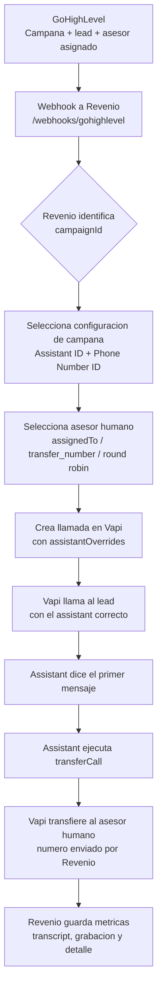

# Flujo de campañas, Vapi y transferencia a asesores

Este documento explica como queda funcionando el flujo de campanas para que socios y operacion tengan la misma imagen mental: GoHighLevel dispara la campana, Revenio decide que asistente de Vapi usar y a que asesor humano transferir, y Vapi ejecuta la llamada.

## Resumen ejecutivo

- GoHighLevel identifica la campana y el lead.
- Revenio recibe el webhook y selecciona la configuracion correcta para esa campana.
- Revenio crea la llamada outbound en Vapi usando el assistant y phone number correctos.
- Vapi habla con el lead usando el prompt/configuracion del assistant.
- Cuando toca transferir, Vapi ejecuta `transferCall`.
- El numero del asesor humano no debe vivir fijo en Vapi: Revenio lo manda dinamicamente con `transfer_number` o lo selecciona por round robin.

## Diagrama del flujo

## Que configura Marina en Vapi

Marina puede duplicar Brenda para crear los nuevos assistants, pero cada assistant debe quedar limpio para que Revenio controle la parte dinamica.

En cada assistant de Vapi:

- Configurar el `First Message` y el `System Prompt` de la campana.
- Mantener el prompt indicando que el assistant debe ejecutar `transferCall` cuando corresponda.
- En `Advanced > Messaging`, usar el Server URL correcto:
  - Staging: `https://revenioapi-staging.up.railway.app/webhooks/vapi/events`
  - Production: `https://revenioapi-production.up.railway.app/webhooks/vapi/events`
- Mantener la configuracion de mensajes de Vapi alineada con Revenio:
  - `Server URL` apunta al ambiente correcto.
  - `Server Messages` permite que Vapi avise a Revenio cuando hay transferencia, transcript y fin de llamada.
  - `Client Messages` puede quedar segun el template de Brenda, siempre que no agregue un flujo paralelo de transferencia.
- Activar Server Messages necesarios:
  - `transfer-update`
  - `transfer-destination-request`
  - `speech-update`
  - `tool-calls`
  - `end-of-call-report`
- Desactivar `phone-call-control` para este flujo.
- Publicar el assistant despues de cualquier cambio.

## Que NO debe quedar fijo en Vapi

Para este flujo, Vapi no debe ser la fuente de verdad del asesor humano.

No dejar fijo en Vapi:

- Un `Forwarding Phone Number` viejo.
- Un destino hardcodeado como `+525527326714`.
- Un segundo `Transfer Call` tool creado manualmente con un numero fijo.

El numero `+525527326714` viene de configuraciones viejas/fallbacks. Si aparece en logs como `forwardedPhoneNumber`, es senal de que Vapi esta usando una configuracion vieja o un fallback, no el asesor seleccionado por Revenio.

## Donde vive la verdad

| Dato | Donde debe vivir |
| --- | --- |
| Campana activa | GoHighLevel, via `campaignId` |
| Assistant de Vapi por campana | Railway variables de Revenio |
| Phone Number ID de Vapi por campana | Railway variables de Revenio |
| Numero del asesor humano | Lab de Revenio, guardado en base de datos |
| Server URL para eventos de Vapi | Vapi `Advanced > Messaging` |
| Ejecucion de transferencia | Vapi ejecuta `transferCall`, inyectado dinamicamente por Revenio |

## Donde edita Marina los agentes

Los numeros del round robin no deben editarse en Railway ni en Vapi.

Para demo/operacion, Marina debe entrar al Lab de Revenio y usar la vista **Agentes GHL**:

1. Seleccionar propiedad o campana.
2. Capturar nombre del asesor.
3. Capturar `GHL User ID`, que debe coincidir con `assignedTo`.
4. Capturar telefono en formato internacional, por ejemplo `+52...`.
5. Marcar si el asesor esta activo.
6. Capturar el fallback final, normalmente el gerente de marketing.
7. Guardar.

Cuando GHL mande un lead, Revenio buscara el `assignedTo` en esta lista y usara ese telefono para transferir la llamada. Si ningun vendedor del pool contesta, Revenio usara el fallback final. Ese fallback no participa en la rotacion normal; solo se usa cuando el pool se agota.

## Por que Vapi puede pedir confirmar transferCall

Vapi necesita saber que el assistant puede transferir llamadas. Eso no significa que el numero final deba quedar fijo dentro de Vapi.

En nuestro flujo:

- Si Vapi pide confirmar la capacidad de transferencia, se confirma para que el assistant pueda ejecutar `transferCall`.
- El destino real de la transferencia lo manda Revenio al crear la llamada.
- Revenio inyecta `transferCall` dinamicamente en `assistantOverrides.model.tools` cuando existe un `transfer_number`.
- Por eso puede verse vacio el menu global de `Tools` en Vapi y aun asi funcionar la transferencia.

## Checklist antes de probar una campana en staging

1. El assistant correcto existe en Vapi y esta publicado.
2. El assistant usa Server URL de staging:
   `https://revenioapi-staging.up.railway.app/webhooks/vapi/events`
3. El assistant no tiene un forwarding/fallback fijo hacia `+525527326714`.
4. No hay un segundo `Transfer Call` tool con destino hardcodeado.
5. Railway staging tiene el Assistant ID y Phone Number ID de esa campana.
6. GHL manda el `campaignId` correcto en el webhook.
7. GHL/Revenio puede resolver el asesor humano y su numero.
8. En logs de Vapi, el numero transferido debe coincidir con el asesor seleccionado por Revenio.

## Como explicar el flujo en una frase

GHL decide que campana y lead entran; Revenio decide que assistant de Vapi usar y a que asesor humano transferir; Vapi solo ejecuta la conversacion y la transferencia con la informacion que Revenio le manda en cada llamada.
